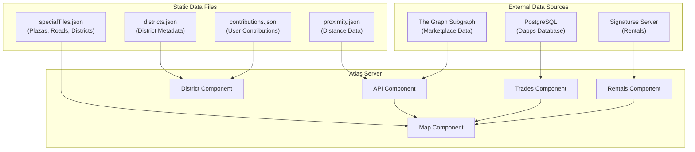

# Database Schema Documentation

This document describes the database interactions for the Atlas Server. The service primarily reads from external data sources and does not manage its own database schema.

## Data Sources Overview

The Atlas Server aggregates data from multiple sources:

1. **The Graph Subgraph** (Primary) - On-chain marketplace data
2. **PostgreSQL Database** (Read-only) - Trades data from dapps database
3. **Signatures Server** (External API) - Rental listings
4. **Static JSON Files** - Districts, contributions, special tiles, proximity data



---

## The Graph Subgraph Data

The primary data source is the Decentraland Marketplace subgraph, queried via `@well-known-components/thegraph-component`.

### Parcel Fragment

Data fetched for each parcel from the subgraph:

| Field                           | Type   | Description                   |
| ------------------------------- | ------ | ----------------------------- |
| `id`                            | string | Unique parcel identifier      |
| `name`                          | string | Parcel name (if set)          |
| `owner.id`                      | string | Owner wallet address          |
| `searchParcelX`                 | string | X coordinate                  |
| `searchParcelY`                 | string | Y coordinate                  |
| `searchParcelEstateId`          | string | Estate ID (if part of estate) |
| `tokenId`                       | string | NFT token ID                  |
| `updatedAt`                     | string | Last update timestamp         |
| `activeOrder.price`             | string | Active sell order price (wei) |
| `activeOrder.expiresAt`         | string | Order expiration timestamp    |
| `parcel.data.name`              | string | Parcel metadata name          |
| `parcel.data.description`       | string | Parcel metadata description   |
| `parcel.estate.tokenId`         | string | Estate token ID               |
| `parcel.estate.size`            | number | Estate size (parcel count)    |
| `parcel.estate.nft.name`        | string | Estate name                   |
| `parcel.estate.nft.activeOrder` | object | Estate sell order             |

### Estate Fragment

Data fetched for estates:

| Field            | Type   | Description                   |
| ---------------- | ------ | ----------------------------- |
| `updatedAt`      | string | Last update timestamp         |
| `estate.parcels` | array  | List of parcels in the estate |

---

## PostgreSQL Database (Read-only)

The service reads from the dapps database for trades data. This database is managed by the marketplace-server.

### Connection Configuration

| Variable                              | Description                  |
| ------------------------------------- | ---------------------------- |
| `PG_COMPONENT_PSQL_CONNECTION_STRING` | PostgreSQL connection string |

### Data Used

The trades component queries order data to supplement tile pricing information that may not yet be indexed by the subgraph.

---

## Signatures Server (Rentals)

Rental listings are fetched from the Signatures Server API.

### Rental Listing Data

| Field         | Type   | Description                       |
| ------------- | ------ | --------------------------------- |
| `nftId`       | string | NFT identifier                    |
| `lessor`      | string | Lessor wallet address             |
| `tenant`      | string | Tenant wallet address (if rented) |
| `pricePerDay` | string | Daily rental price                |
| `startedAt`   | string | Rental start timestamp            |
| `endsAt`      | string | Rental end timestamp              |
| `status`      | string | Rental status                     |

---

## Static Data Files

### specialTiles.json

Pre-defined tiles for plazas, roads, and districts:

```json
{
  "id": "string (x,y)",
  "type": "'plaza' | 'road' | 'district'",
  "top": "boolean",
  "left": "boolean",
  "topLeft": "boolean",
  "name": "string (optional)"
}
```

**Location:** `src/modules/map/data/specialTiles.json`

### districts.json

Genesis City districts metadata:

```json
{
  "id": "string",
  "name": "string",
  "description": "string",
  "parcels": ["string (x,y)"],
  "totalParcels": "number"
}
```

**Location:** `src/modules/district/data/districts.json`

### contributions.json

User contributions to districts:

```json
{
  "address": "string (wallet address)",
  "districtId": "string",
  "totalParcels": "number"
}
```

**Location:** `src/modules/district/data/contributions.json`

### proximity.json

Distance data from special locations:

```json
{
  "x,y": {
    "district": "number (optional)",
    "road": "number (optional)",
    "plaza": "number (optional)"
  }
}
```

**Location:** `src/modules/api/data/proximity.json`

---

## Tile Data Structure

The aggregated tile data structure served by the API:

| Field           | Type     | Description                                     |
| --------------- | -------- | ----------------------------------------------- |
| `id`            | string   | Tile ID (`x,y` format)                          |
| `x`             | number   | X coordinate                                    |
| `y`             | number   | Y coordinate                                    |
| `nftId`         | string   | NFT identifier (optional)                       |
| `type`          | TileType | `owned`, `unowned`, `plaza`, `road`, `district` |
| `top`           | boolean  | Has adjacent tile on top                        |
| `left`          | boolean  | Has adjacent tile on left                       |
| `topLeft`       | boolean  | Has adjacent tile on top-left                   |
| `updatedAt`     | number   | Last update timestamp (ms)                      |
| `name`          | string   | Tile/parcel/estate name (optional)              |
| `owner`         | string   | Owner wallet address (optional)                 |
| `estateId`      | string   | Estate ID if part of estate (optional)          |
| `tokenId`       | string   | NFT token ID (optional)                         |
| `price`         | number   | Active order price in ETH (optional)            |
| `expiresAt`     | number   | Order expiration timestamp (optional)           |
| `rentalListing` | object   | Rental listing data (optional)                  |

---

## NFT Metadata Structure (OpenSea Standard)

Metadata returned for parcels and estates:

| Field              | Type   | Description          |
| ------------------ | ------ | -------------------- |
| `id`               | string | NFT identifier       |
| `name`             | string | NFT name             |
| `description`      | string | NFT description      |
| `image`            | string | Image URL            |
| `external_url`     | string | Marketplace URL      |
| `background_color` | string | Background color hex |
| `attributes`       | array  | Trait attributes     |

### Attribute Structure

```json
{
  "trait_type": "string",
  "value": "number",
  "display_type": "number"
}
```

---

## Caching & Storage

### AWS S3 / MinIO

Generated map images and tile data are cached to S3-compatible storage:

| Configuration     | Description                   |
| ----------------- | ----------------------------- |
| `AWS_S3_BUCKET`   | Bucket name for stored assets |
| `AWS_S3_ENDPOINT` | S3/MinIO endpoint URL         |
| `AWS_S3_REGION`   | S3 region                     |

### In-Memory Cache

The map component maintains an in-memory cache of all tiles, refreshed periodically based on `REFRESH_INTERVAL`.

---

## Related Code

- **Subgraph Queries**: `src/modules/api/component.ts`
- **Trades Queries**: `src/modules/trades/component.ts`
- **Rentals Integration**: `src/modules/rentals/component.ts`
- **Map Data Management**: `src/modules/map/component.ts`
- **District Data**: `src/modules/district/component.ts`
- **S3 Storage**: `src/modules/s3/component.ts`
- **Static Data**: `src/modules/*/data/*.json`
